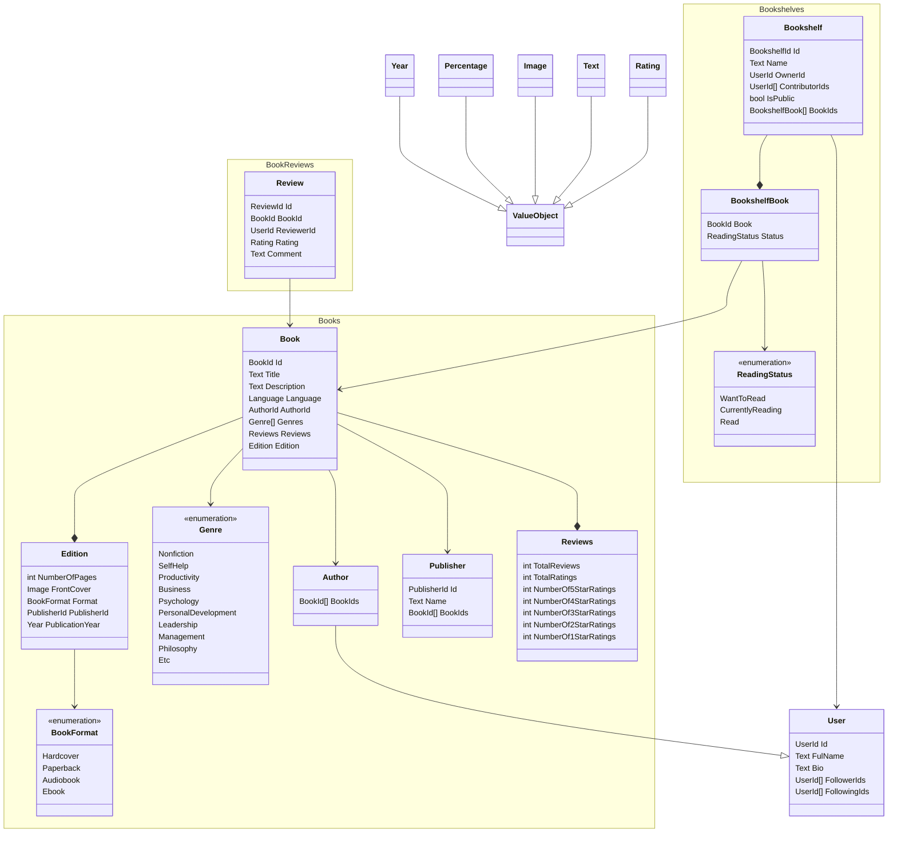

# Eudaimonia

```mermaid
classDiagram
    %% note "If a Book has AuthorId property - Should we call it Author or AuthorId in terms of DDD?"
    %% note for Review "Consider adding likes or upvotes / downvotes & comments??"
    %% note for Genre "If this is not a finite list, we can use enumeration class."

    Year --|> ValueObject 
    Percentage --|> ValueObject 
    Image --|> ValueObject 
    Text --|> ValueObject
    Rating --|> ValueObject
    
    Book --* Edition
    Book --> Genre
    Book --> Author
    Book --> Publisher
    Book --* Reviews

    Review --> Book

    Author --|> User 

    Edition --> BookFormat

    Bookshelf --> User
    
    Bookshelf --* BookshelfBook

    BookshelfBook --> ReadingStatus
    BookshelfBook --> Book

    namespace Books {
        class Book {
            BookId Id
            Text Title
            Text Description
            Language Language
            AuthorId AuthorId
            Genre[] Genres
            Reviews Reviews
            Edition Edition
        }

        class Edition {
            int NumberOfPages
            Image FrontCover
            BookFormat Format
            PublisherId PublisherId
            Year PublicationYear
        }
  
        class BookFormat {
            <<enumeration>>
            Hardcover
            Paperback
            Audiobook
            Ebook
        }
  
        class Genre {
            <<enumeration>>
            Nonfiction
            SelfHelp
            Productivity
            Business
            Psychology
            PersonalDevelopment
            Leadership
            Management
            Philosophy
            Etc
        }

        class Reviews {
            int TotalReviews
            int TotalRatings
            int NumberOf5StarRatings
            int NumberOf4StarRatings
            int NumberOf3StarRatings
            int NumberOf2StarRatings
            int NumberOf1StarRatings
        }

        class Author {
            BookId[] BookIds
        }

        class Publisher {
            PublisherId Id
            Text Name
            BookId[] BookIds
        }        
    }
 
    namespace BookReviews {
        class Review {
            ReviewId Id
            BookId BookId
            UserId ReviewerId
            Rating Rating
            Text Comment
        }
    }

    namespace Bookshelves {
        class Bookshelf {
            BookshelfId Id
            Text Name
            UserId OwnerId
            UserId[] ContributorIds
            bool IsPublic
            BookshelfBook[] BookIds
        }

        class BookshelfBook {
            BookId Book
            ReadingStatus Status
        }

        class ReadingStatus {
            <<enumeration>>
            WantToRead
            CurrentlyReading
            Read
        }
    }

  class User {
    UserId Id
    Text FulName
    Text Bio
    UserId[] FollowerIds
    UserId[] FollowingIds
  }
```