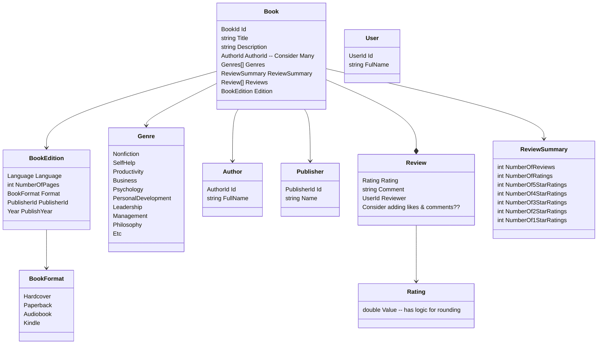

# Eudaimonia

```mermaid
classDiagram
  Book --> BookEdition
  Book --> Genre
  Book --> Author
  Book --> Publisher
  Book --* Review
  Book --> ReviewSummary

  BookEdition --> BookFormat

  Review --> Rating


  class Book {
    BookId Id
    string Title
    string Description
    AuthorId AuthorId -- Consider Many
    Genres[] Genres
    ReviewSummary ReviewSummary
    Review[] Reviews
    BookEdition Edition
  }

  class BookEdition {
    Language Language
    int NumberOfPages
    BookFormat Format
    PublisherId PublisherId
    Year PublishYear
  }
  
  class BookFormat {
    Hardcover
    Paperback
    Audiobook
    Kindle
  }

  class Genre {
    Nonfiction
    SelfHelp
    Productivity
    Business
    Psychology
    PersonalDevelopment
    Leadership
    Management
    Philosophy
    Etc
  }

  class ReviewSummary {
    int NumberOfReviews
    int NumberOfRatings
    int NumberOf5StarRatings
    int NumberOf4StarRatings
    int NumberOf3StarRatings
    int NumberOf2StarRatings
    int NumberOf1StarRatings
  }

  class Review {
    Rating Rating
    string Comment
    UserId Reviewer
    Consider adding likes & comments??
  }

  class Rating {
    double Value -- has logic for rounding
  }

  class User {
    UserId Id
    string FulName
  }


  class Author {
    AuthorId Id
    string FullName
    
  }

  class Publisher {
    PublisherId Id
    string Name
  }
```