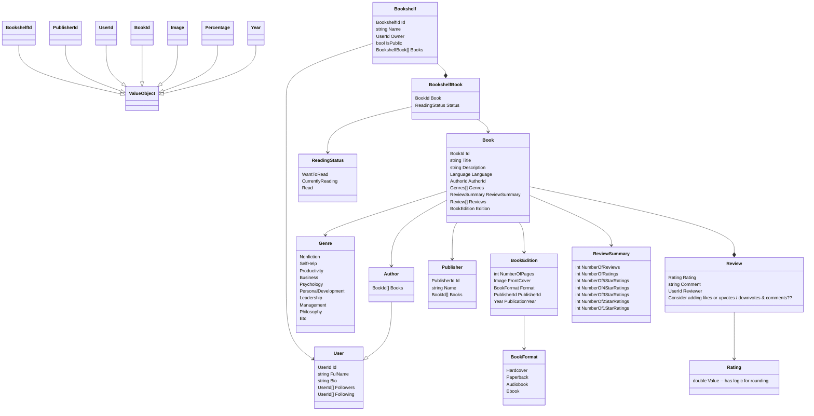

# Eudaimonia

```mermaid
classDiagram
  Year --|> ValueObject 
  Percentage --|> ValueObject 
  Image --|> ValueObject 
  
  BookId --|> ValueObject 
  UserId --|> ValueObject
  PublisherId --|> ValueObject 
  BookshelfId --|> ValueObject 

  Book --> BookEdition
  Book --> Genre
  Book --> Author
  Book --> Publisher
  Book --* Review
  Book --> ReviewSummary

  Author --|> User 

  BookEdition --> BookFormat

  Review --> Rating

  Bookshelf --> User
  
  Bookshelf --* BookshelfBook

  BookshelfBook --> ReadingStatus
  BookshelfBook --> Book

  class Book {
    BookId Id
    string Title
    string Description
    Language Language
    AuthorId AuthorId
    Genres[] Genres
    ReviewSummary ReviewSummary
    Review[] Reviews
    BookEdition Edition
  }

  class BookEdition {
    int NumberOfPages
    Image FrontCover
    BookFormat Format
    PublisherId PublisherId
    Year PublicationYear
  }
  
  class BookFormat {
    Hardcover
    Paperback
    Audiobook
    Ebook
  }

  class Genre {
    Nonfiction
    SelfHelp
    Productivity
    Business
    Psychology
    PersonalDevelopment
    Leadership
    Management
    Philosophy
    Etc
  }

  class ReviewSummary {
    int NumberOfReviews
    int NumberOfRatings
    int NumberOf5StarRatings
    int NumberOf4StarRatings
    int NumberOf3StarRatings
    int NumberOf2StarRatings
    int NumberOf1StarRatings
  }

  class Review {
    Rating Rating
    string Comment
    UserId Reviewer
    Consider adding likes or upvotes / downvotes & comments??
  }

  class Rating {
    double Value -- has logic for rounding
  }

  class User {
    UserId Id
    string FulName
    string Bio
    UserId[] Followers
    UserId[] Following
  }

  class Bookshelf {
    BookshelfId Id
    string Name
    UserId Owner
    bool IsPublic
    BookshelfBook[] Books
  }

  class BookshelfBook {
    BookId Book
    ReadingStatus Status
  }

  class ReadingStatus {
    WantToRead
    CurrentlyReading
    Read
  }

  class Author {
    BookId[] Books
  }

  class Publisher {
    PublisherId Id
    string Name
    BookId[] Books
  }
```