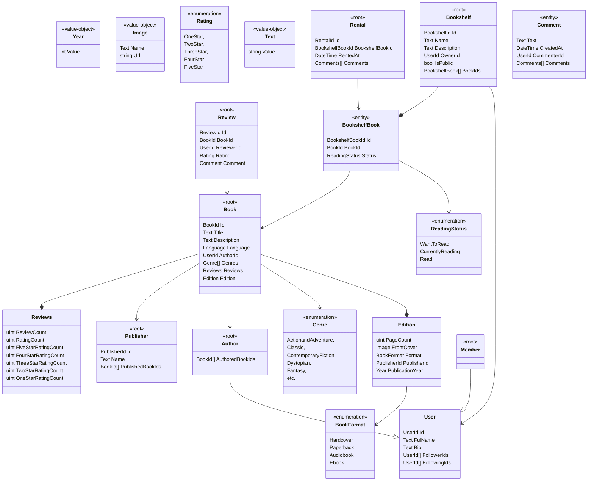

# Eudaimonia

```mermaid
classDiagram
    class Year {
        <<value-object>>
        int Value
    }

    class Image {
        <<value-object>>
        Text Name
        string Url
    }

    class Rating {
        <<enumeration>>
        OneStar,
        TwoStar,
        ThreeStar,
        FourStar
        FiveStar
    }

    class Text {
        <<value-object>>
        string Value
    }
    
    Book --* Edition
    Book --> Genre
    Book --> Author
    Book --> Publisher
    Book --* Reviews

    Review --> Book

    Author --|> User 
    Member --|> User

    Edition --> BookFormat

    Bookshelf --> User
    
    Bookshelf --* BookshelfBook

    BookshelfBook --> ReadingStatus
    BookshelfBook --> Book

    Rental --> BookshelfBook

    class Book {
        <<root>>
        BookId Id
        Text Title
        Text Description
        Language Language
        UserId AuthorId
        Genre[] Genres
        Reviews Reviews
        Edition Edition
    }

    class Edition {
        uint PageCount
        Image FrontCover
        BookFormat Format
        PublisherId PublisherId
        Year PublicationYear
    }
  
    class BookFormat {
        <<enumeration>>
        Hardcover
        Paperback
        Audiobook
        Ebook
    }
  
    class Genre {
        <<enumeration>>
        ActionandAdventure,
        Classic,
        ContemporaryFiction,
        Dystopian,
        Fantasy,
        etc.
    }

    class Reviews {
        uint ReviewCount
        uint RatingCount
        uint FiveStarRatingCount
        uint FourStarRatingCount
        uint ThreeStarRatingCount
        uint TwoStarRatingCount
        uint OneStarRatingCount
    }

    class Author {
        <<root>>
        BookId[] AuthoredBookIds
    }

    class Publisher {
        <<root>>
        PublisherId Id
        Text Name
        BookId[] PublishedBookIds
    }        
 
    class Review {
        <<root>>
        ReviewId Id
        BookId BookId
        UserId ReviewerId
        Rating Rating
        Comment Comment
    }

    class Bookshelf {
        <<root>>
        BookshelfId Id
        Text Name
        Text Description
        UserId OwnerId
        bool IsPublic
        BookshelfBook[] BookIds
    }

    class BookshelfBook {
        <<entity>>
        BookshelfBookId Id
        BookId BookId
        ReadingStatus Status
    }

    class ReadingStatus {
        <<enumeration>>
        WantToRead
        CurrentlyReading
        Read
    }

    class Rental {
        <<root>>
        RentalId Id
        BookshelfBookId BookshelfBookId
        DateTime RentedAt
        Comments[] Comments
    }

    class Member {
        <<root>>
    }

    class User {
        UserId Id
        Text FulName
        Text Bio
        UserId[] FollowerIds
        UserId[] FollowingIds
    }

    class Comment {
        <<entity>>
        Text Text
        DateTime CreatedAt
        UserId CommenterId
        Comments[] Comments
    }  
```